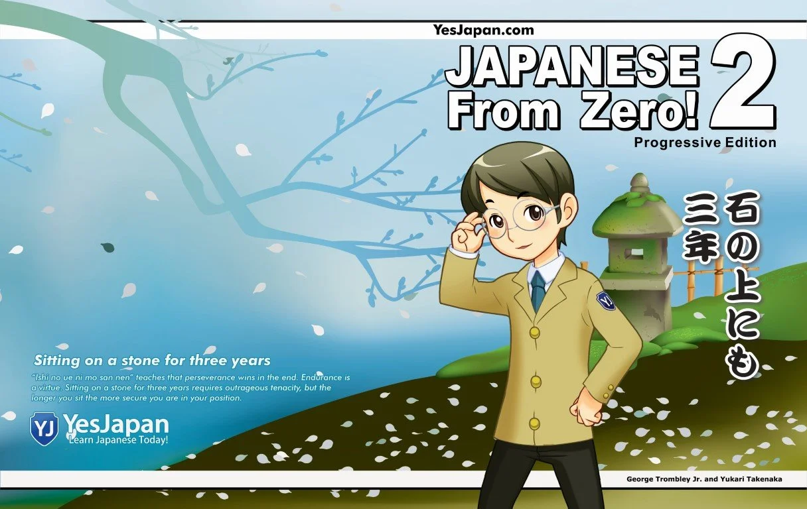
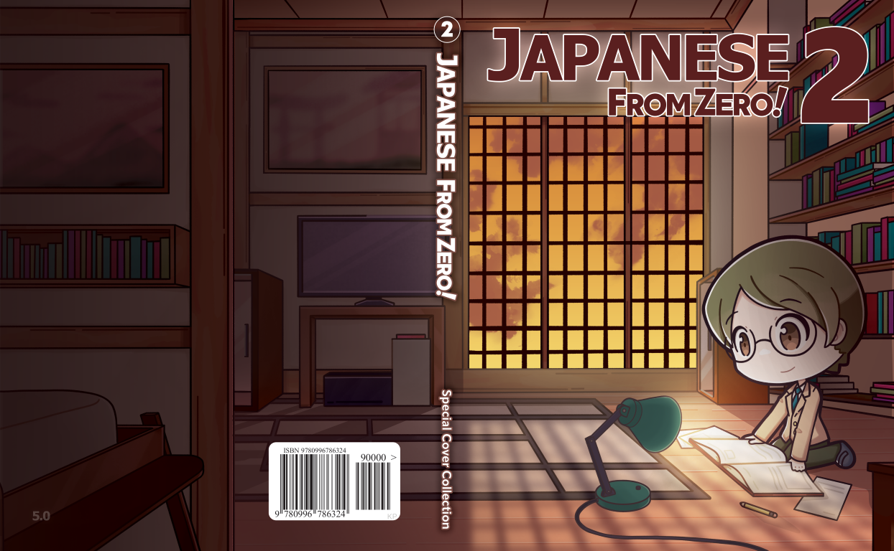
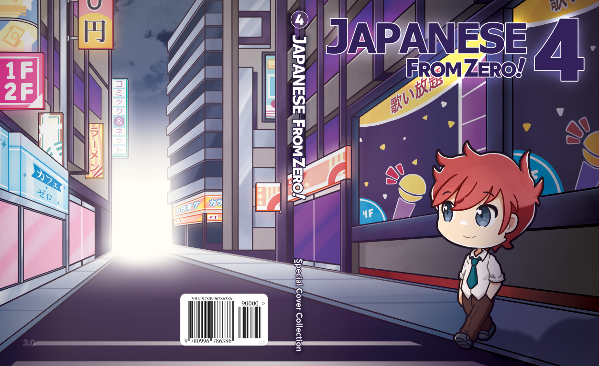

Around 2012 I was pacing in the area just behind six Japanese engineering staff training on how to service and repair Varian Medical’s Clinac Linear Accelerator. The six week class taught the students, who had flown in from various parts of Japan, how to signal trace power signals from the main power board back to the modulator, how to steer the photon beam it generated, and most importantly fix the machine when it was malfunctioning often with patient’s waiting for their fractionalized doses of radiation timed to hit cancer cells when they were weakest during mitosis.

I was their sole simultaneous interpreter for six weeks for up to eight or more hours a day. It all depended on how long it took to fix a multi-million dollar machine purposely broken by their crafty trainer. They would often spend the entire afternoon using their signal tracing skills and other diagnostic tools to Sherlock Holmes their way to an answer.

Prior to these labs, I would stretch my brain to interpret procedures on how to flatten the electron beam, or how to break vacuum on the accelerator without destroying it to replace the electron gun, or maybe explain how to safely discharge the high-voltage capacitor. Imagine running a marathon with your brain. That’s what this was for me.

But every now and then there would be times where I was on stand by. It was these times that I sat with my laptop in the lab, and fantasized about new special covers for the Japanese From Zero! book series I had written with my wife since 1998.

Compared to the thrashing my neurons would receive being a machine to transfer thoughts from English to Japanese or vice-versa, working on the book covers was pure bliss. I took advantage of open moments to create five special covers that I was in love with. Here they are in all their glory.

## Japanese From Zero! — unreleased 2012 special covers

I printed them as posters and hung them proudly on my office wall. The ageless characters on the books kept watch over the office when I was away in Japan or Korea for sometimes two months at a time. They were even there when I was in Beijing interpreting for Varian at their Chinese facility. And they even witnessed the office having it’s window smashed and locked door opened from the inside allowing thousands of dollars of equipment be nabbed by smash and grab thieves. But that’s where they stayed silently hoping maybe one day they would be on a book.

And you might be thinking, why wouldn’t he just release them. They were certainly better than the book covers at the time. And many would say they’re even better than the books selling in 2022. The answer is fear. The book series has done extremely well in the marketplace. On the hourly Amazon sales ranking, we normally hold two or three spots of the top ten best selling books in the [Japanese Language Instruction](https://www.amazon.com/gp/bestsellers/books/684266011/ref=zg_b_bs_684266011_1) category. *(images from November 18, 2022)*

Japanese From Zero! series are so often best sellers that I can confidently say that even right now, months after this blog, they’re probably number one. Unless I get cancelled or something drastically shifts in the marketplace this probably won’t change.

But… what if I totally redesigned the covers of these books? What if the stark colors of the current covers are what helped them garner enough attention to make the books sell so well. For a long time the books new cover concepts would come up in meetings, but for ten years we never came up with a fool proof way to release them and not possibly upset the delicate balance of the Japanese textbook marketplace we sit atop.

That was until now. In 2022 we are finally releasing new covers. Not designed by me, but designed by Alex, or Silt as we all call him. Prior to the new covers he spearheaded an amazing redesign of our new [Japanese courses website FromZero.com](https://fromzero.com). For the new site he created chibi versions of our book characters, originally designed by the same company that created Stein’s Gate. And they are fantastic. From today, these covers are available for the SAME retail price as our current books. It’s with great pleasure that my ten-year itch to have new special edition book covers is realized. I hope you think they are as creative and fun as I do.

## 2022 chibi special cover editions for Japanese From Zero!

But before we go I’ll answer the question many of you might have. Are these new versions of the books? No they are the same content of our existing books. They really are just a limited special cover. Everything is the same except for the new art.

Please check out the new special, only available for a limited time, book covers over at our new FromZero shop at [shop.fromzero.com](https://shop.fromzero.com) and let me know what you think.
